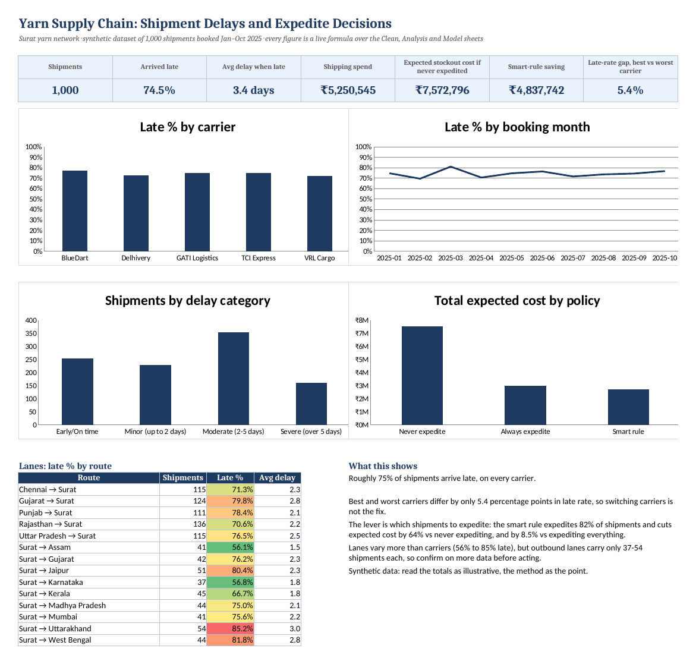
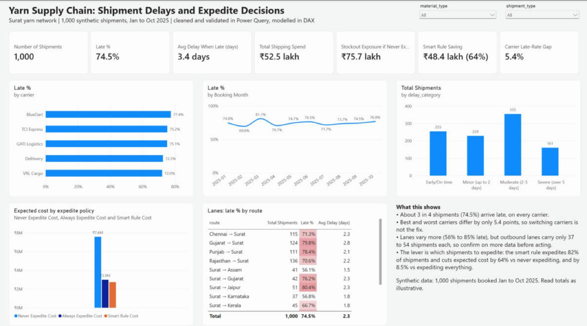

# 🧶 Yarn Supply Chain: Shipment Delays and Expedite Decisions

A Surat-based yarn company ships raw yarn in from Gujarat, Chennai, Punjab, Rajasthan and Uttar Pradesh, and sends finished yarn out to Mumbai, Jaipur, Madhya Pradesh, Assam, Kerala, West Bengal, Karnataka, Uttarakhand and Gujarat. Most shipments arrive late, and a late shipment can stop production or delay a customer order.

**Business question:** which shipments are worth paying an expedite surcharge for, and how much does that save compared with never expediting or expediting everything?

The same dataset is analysed three ways:

| Part | Tool | What it does |
|---|---|---|
| [Excel analysis](#1-excel-analysis) | Microsoft Excel | Data cleaning and validation, delay analysis, the expedite cost model with what-if inputs, and a dashboard |
| [Power BI dashboard](#2-power-bi-dashboard) | Power BI, Power Query, DAX | Interactive version of the analysis and the expedite rule |
| [Python model](#3-python-model) | pandas, scikit-learn | Tests whether delays can be predicted per shipment with machine learning |

> **Data note:** `yarn_supplychain_surat.csv` is a synthetic dataset of 1,000 shipments booked January to October 2025. Treat the rupee totals as illustrative; the method is the point.

---

## Key findings

The Excel workbook and the Power BI dashboard calculate these independently and agree.

| Finding | Number |
|---|---|
| Shipments that arrived late | **74.5%** (745 of 1,000) |
| Average delay of a late shipment | **3.4 days** |
| Gap in late rate between the best and worst carrier | **5.4 percentage points** (VRL Cargo 72.0% to BlueDart 77.4%) |
| Late rate by route | **56% to 85%**, but outbound routes have only 37 to 54 shipments each |
| Expected stockout cost if nothing is expedited | **₹75.7 lakh** |
| Cost if every shipment is expedited | **₹29.9 lakh** |
| Cost under the smart expedite rule | **₹27.4 lakh** (expedites 822 of 1,000 shipments) |
| Saving from the smart rule | **₹48.4 lakh (64%)** vs never expediting, **8.5%** vs expediting everything |

**What this means:** every carrier is late about three times in four, so switching carriers is not the fix. The lever is choosing which shipments to expedite.

## The expedite rule

```
Chance of delay         = the carrier's historical late rate
Expected stockout cost  = chance of delay × quantity (tonnes) × stockout cost per tonne
Decision                = Expedite if expedite surcharge < expected stockout cost, else Standard
```

Assumptions:

1. Base shipping cost is paid either way, so only the expedite surcharge counts as the extra cost of expediting.
2. An expedited shipment is assumed to arrive on time. The Excel model lets you lower this "expedite effectiveness" and see the effect.
3. The late rates come from the same data they are applied to (in-sample), so the result is illustrative.

---

## 1. Excel analysis

File: [`excel/Shipment_Delay_Analysis.xlsx`](excel/Shipment_Delay_Analysis.xlsx). Every number is a live formula, so changing an input recalculates the whole workbook.



| Sheet | What it does |
|---|---|
| `Raw` | The CSV exactly as received, with dates kept as text |
| `Location_Map` | Maps each place to a state and region (the source data mixes city and state names) |
| `Clean` | Converts text dates with `DATE`/`TIME`, maps locations with `INDEX`/`MATCH`, recomputes delay, buckets delay with `IFS`, and adds route, month, lead time and transit time |
| `Data_Quality` | Formula checks with PASS/CHECK status |
| `Analysis` | Late %, average delay, cost per tonne and returns by carrier, month, material, shipment type, temperature sensitivity, region, route and delay category, using `COUNTIFS`, `AVERAGEIFS` and `SUMIFS`. Routes are colour-scaled. |
| `Model` | Expedite model: input cells, Never / Always / Smart comparison, sensitivity grids, and a single-shipment calculator |
| `Model_Detail` | The expedite decision for each of the 1,000 shipments |
| `Dashboard` | KPI cards, four charts, a route table and formula-driven takeaways |

**Data quality results:** 1,000 rows loaded; no blank cells, duplicate shipment IDs or unmapped locations; recorded delay matches arrival minus scheduled arrival on every row; the late flag agrees with delay days on every row; no shipment arrives before it departs or departs before it is booked. 244 shipments arrived early (negative delay), which is valid, not an error.

**What-if inputs (Model sheet):**
- **Stockout cost multiplier** (default 1.0) scales every stockout cost up or down.
- **Expedite effectiveness** (default 100%) is the share of delay risk an expedite removes.
- **Sensitivity grids** show the saving and the share of shipments expedited for multipliers from 0.25 to 2 and effectiveness of 50%, 75% and 100% (built with `SUMPRODUCT`).
- **Single-shipment calculator:** pick a shipment ID from the dropdown to see its carrier, risk, net benefit of expediting, and the break-even stockout cost per tonne.

**Excel functions used:** `INDEX`/`MATCH`, `IFERROR`, `IFS`, `COUNTIFS`, `AVERAGEIFS`, `SUMIFS`, `SUMPRODUCT`, `COUNTIF`, `DATE`, `TIME`, `LEFT`/`MID`, `TEXT`, plus conditional formatting, data validation and charts.

## 2. Power BI dashboard

File: [`powerbi/Supply_Chain_Delay_Analysis.pbix`](powerbi/Supply_Chain_Delay_Analysis.pbix)



- **Power Query:** loads the CSV, sets column types, checks for duplicates, and joins a location-to-region mapping.
- **DAX:** calculated columns for each carrier's late rate, the expected stockout cost and the expedite decision. Measures for the Never, Always and Smart policy costs, the saving, and the carrier late-rate gap.
- **Report:** KPI cards, late % by carrier, month and route, shipments by delay category, the policy cost comparison, slicers for material type and shipment type, and written takeaways.

## 3. Python model

File: [`main.py`](main.py). Random forest models try to predict, for each shipment, whether it will be late and by how many days. The features are lead time, planned transit time, departure weekday and month, the carrier's recent late rate, quantity, costs and temperature sensitivity.

Results from the current script (last 20% of rows held out for testing):

| Model | Metric | Result |
|---|---|---|
| Delay classifier | ROC-AUC | **0.56** |
| Delay-days regressor | Mean absolute error | **2.25 days** |

An ROC-AUC of 0.56 is barely better than a coin flip (0.5). With the features available, individual delays are close to unpredictable in this dataset. That is why the Excel and Power BI models use each carrier's historical late rate as the chance of delay, rather than a per-shipment prediction.

The script also applies the expedite rule to the last 300 shipments using the predicted probabilities. Expected cost falls from ₹37.6 lakh to ₹24.0 lakh, with 224 of 300 shipments expedited.

Charts from an earlier run of the script (the ROC curve there shows 0.635; the current script gives 0.56):

| | |
|---|---|
|  ROC curve |  Delay distribution |
|  Average delay by carrier |  Shipping cost vs delay |
|  Baseline vs optimised cost |  Expedite decisions |
|  Predicted delay probability | |

---

## Limitations

- The data is synthetic, so the rupee figures are illustrative.
- Late rates are measured on the same shipments they are applied to. A real rollout would measure them on past shipments and test on future ones.
- The model assumes an expedited shipment arrives on time unless expedite effectiveness is lowered.
- Outbound routes have few shipments each, so the differences between routes need more data before anyone acts on them.

## How to use

**Excel:** open `excel/Shipment_Delay_Analysis.xlsx` (Excel 2019 or later) and click **Enable Editing** so formulas recalculate. Change the yellow input cells on the `Model` sheet, or pick a shipment ID in the calculator.

**Power BI:** open `powerbi/Supply_Chain_Delay_Analysis.pbix` in Power BI Desktop. Use the slicers at the top right to filter by material type or shipment type.

**Python:**

```bash
pip install pandas numpy scikit-learn matplotlib seaborn
python main.py yarn_supplychain_surat.csv
```

## Tech stack

Microsoft Excel · Power BI (Power Query, DAX) · Python (pandas, NumPy, scikit-learn, Matplotlib, seaborn)
